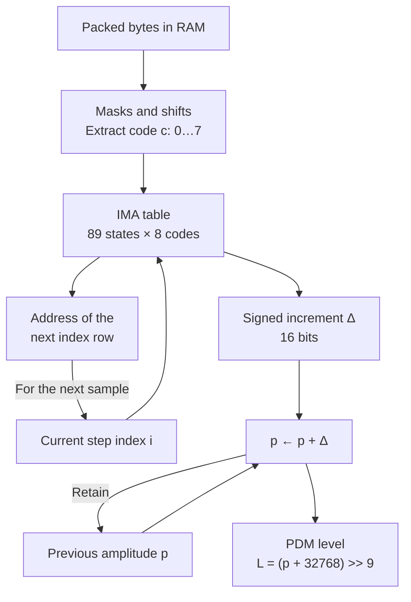
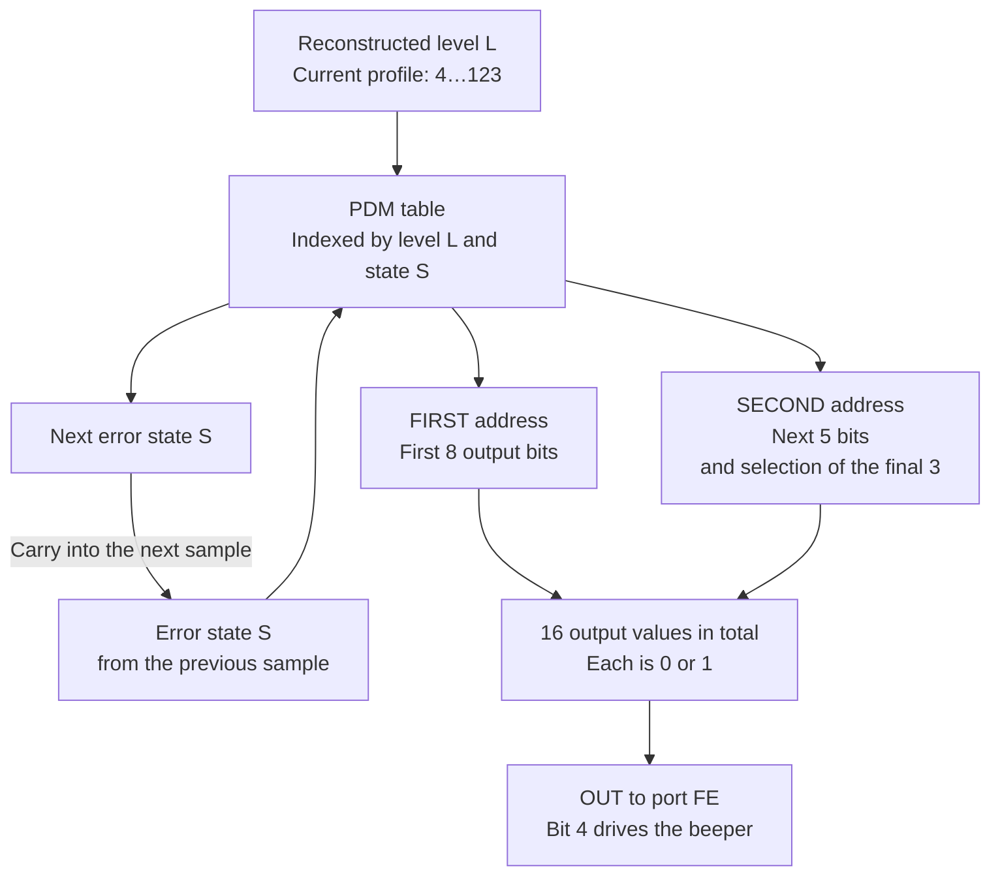
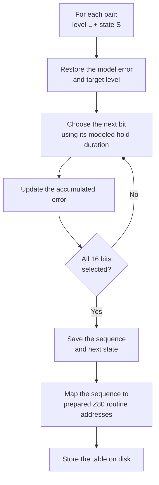
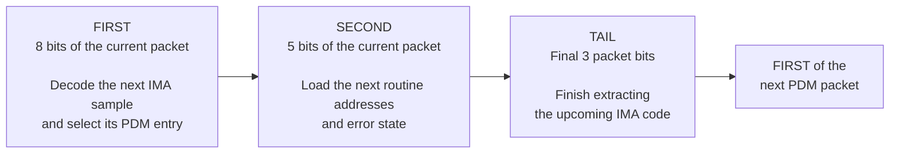

# From packed IMA3 to beeper PDM

Documented 2026-10-04 for the current direct IMA3 player.
[Russian version](IMA3_PDM_PIPELINE.ru.md).

A three-bit IMA code describes a change in amplitude. The PDM sequence is
selected from the reconstructed amplitude and the modulator's saved error
state. The packed stream is loaded from disk into RAM without expansion;
decoding takes place during playback. See [disk loading and capacity](IMA3_SERIES.md).

## 1. Extract a three-bit code

Eight codes occupy three bytes. Each row below runs from the byte's most
significant bit to its least significant bit; code bit 0 is the least significant.

```text
Byte 0, bits 7..0: [ c2 bits 1..0 ][ c1 bits 2..0 ][ c0 bits 2..0 ]
Byte 1, bits 7..0: [ c5 bit 0 ][ c4 bits 2..0 ][ c3 bits 2..0 ][ c2 bit 2 ]
Byte 2, bits 7..0: [ c7 bits 2..0 ][ c6 bits 2..0 ][ c5 bits 2..1 ]

Decode order: c0 -> c1 -> c2 -> c3 -> c4 -> c5 -> c6 -> c7
```

Codes `c2` and `c5` cross byte boundaries. Eight specialized extraction
phases use masks and rotations to obtain successive codes directly from RAM.
The player does not expand them into an IMA4 array.

## 2. Reconstruct the IMA amplitude



Write a three-bit code as `s a b`: sign and two magnitude bits. It selects
one of the eight even codes of the ordinary IMA alphabet. For the current
step size, its increment is:

```text
magnitude = (step >> 3) + a × step + b × (step >> 1)
Δ         = magnitude, negated when s = 1
```

The Z80 does not evaluate this formula at runtime. A four-byte table entry
contains the ready-made 16-bit increment and a 16-bit pointer to the next
index row. The complete table occupies `89 × 8 × 4 = 2848` bytes.

The predictor is stored in `IX` with a bias: `IX = p + 32768`. The upper
bits select one of 128 PDM levels. The encoder restricts the current profile
to levels 4…123 and proves that predictor additions do not overflow; the
hot path does not perform saturation checks. Initial predictor/index are 0/0.

## 3. Select PDM output and carry the error state



The same amplitude can produce different PDM sequences for different error
states. Carrying the error lets later packets compensate for excess or
missing area in earlier pulses. `S` is a quantized model state, not a measured
voltage or a physical feedback input.

The current build has 17 reachable states. Its six-byte table entry has this
layout, with addresses stored little-endian:

| Offset | Size | Contents |
| --- | ---: | --- |
| 0 | 2 bytes | SECOND routine address |
| 2 | 1 byte | Next state offset, loaded into E |
| 3 | 1 byte | Constant 16, loaded into D |
| 4 | 2 bytes | FIRST routine address |

The state offset is six times the state's position in the reachable-state
list. `D = 16` supplies the high beeper bit. The addresses select executable
code that emits the packet, so no RAM buffer of PDM words is needed.

## 4. Build the PDM tables on the PC



The model uses duration weights and modified feedback with `beta = 0.5`.
Its accumulated and recent errors are quantized into the next state.
This arithmetic runs on the PC during table construction. The Spectrum
looks up its results during playback.

The overlapping waveform search is another PC operation: it chooses IMA
codes against the expected filtered, timed PDM output. Its 64-sample commits
do not introduce a corresponding runtime buffer or boundary operation.
See [the speech boundary-error correction](experiments/ima-3bit-overlap/README.md).

## 5. Interleave decoding with output on the Z80



Decoding instructions execute between output instructions. The pipeline is
ahead of the audible packet: while packet `n` is being emitted, FIRST decodes
sample `n+1`, and the later extraction prepares code `n+2` for the next FIRST.
Startup primes the pipeline separately. The diagram describes ordinary
packets; bank changes and the final silent guard have dedicated paths.

There are 16 output values per ordinary audio sample. The qualified speech
preview measured about **127.65 kHz mean PDM output rate**. Individual OUT
intervals differ; this is not a uniform carrier clock. Playback disables
interrupts and uses no runtime disk reads. Native ordinary cost remains
**427.375 T/sample**, excluding ULA waits, disk and ROM execution.

Packed IMA3 stays in RAM. Predictor and state are retained in registers,
and selected routines generate the pulses. There is no complete PCM array,
resident IMA4 expansion, or prepared PDM stream buffer.

## Implementation references

- [Packing and table construction](ima3_direct_player.py): `pack3`, `layout`, `build_disk`.
- [Offline PDM model](probe_feedback_packets.py): `integral_table`.
- [Z80 player](ima3-direct-player.asm): `ready`, `FIRST`, `SECOND`, `TAIL`.
- [Verified profile and reachable states](experiments/ima-3bit-overlap/disk/part-01/player.json).
- [Complete measurement evidence](experiments/ima-3bit-overlap/README.md).
