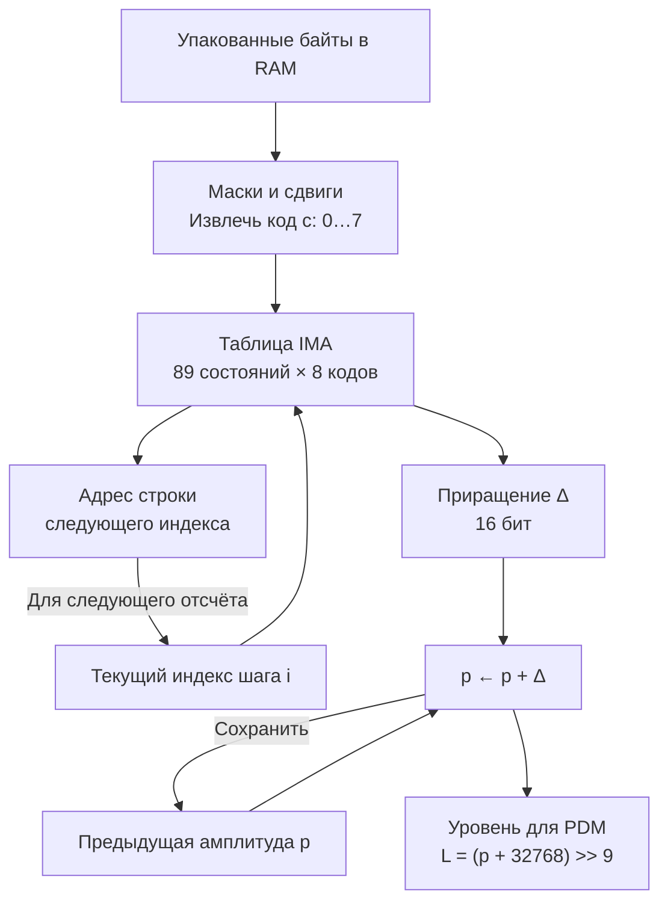
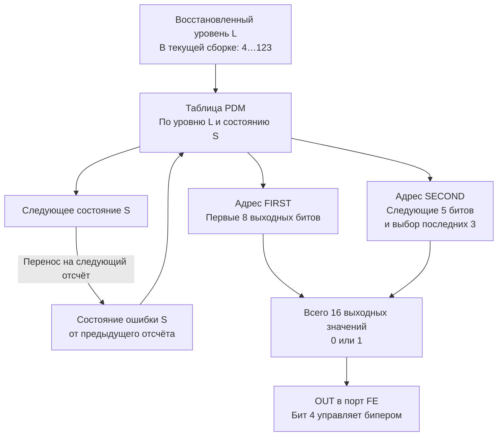
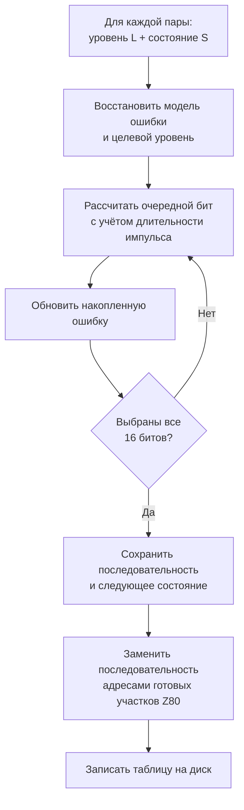
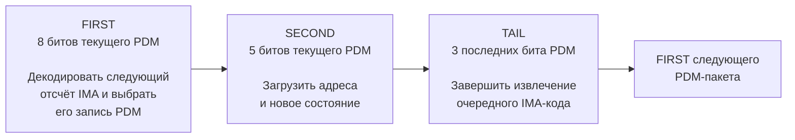

# От упакованного IMA3 к PDM на бипере

Описание от 2026-10-04 для текущего плеера с прямым декодированием IMA3.
[English version](IMA3_PDM_PIPELINE.md).

Три бита IMA задают **изменение амплитуды**. Последовательность PDM выбирается
по восстановленной амплитуде и сохранённому состоянию ошибки модулятора.
С дискеты поток загружается в RAM в упакованном виде; декодирование происходит
во время воспроизведения. Подробнее: [загрузка и вместимость](IMA3_SERIES.md).

## 1. Извлечение трёхбитного кода

В памяти восемь кодов занимают три байта. В каждой строке ниже сначала
показаны старшие биты байта, затем младшие; бит 0 кода — младший.

```text
Байт 0, биты 7..0: [ c2: биты 1..0 ][ c1: биты 2..0 ][ c0: биты 2..0 ]
Байт 1, биты 7..0: [ c5: бит 0 ][ c4: биты 2..0 ][ c3: биты 2..0 ][ c2: бит 2 ]
Байт 2, биты 7..0: [ c7: биты 2..0 ][ c6: биты 2..0 ][ c5: биты 2..1 ]

Порядок декодирования: c0 → c1 → c2 → c3 → c4 → c5 → c6 → c7
```

Коды `c2` и `c5` пересекают границы байтов. Для каждого из восьми положений
есть свой короткий участок команд с масками и циклическими сдвигами.
Массив четырёхбитных кодов IMA в памяти не создаётся.

## 2. Восстановление амплитуды IMA



Трёхбитный код можно представить как `s a b`: знак и два бита величины.
Он выбирает один из восьми чётных кодов обычного IMA. При текущем шаге `step`:

```text
величина = (step >> 3) + a × step + b × (step >> 1)
Δ        = величина, взятая со знаком минус при s = 1
```

**Z80 эту формулу не вычисляет**: готовое 16-битное приращение и 16-битный
адрес следующей строки лежат в таблице. Запись занимает четыре байта,
вся таблица — `89 × 8 × 4 = 2848` байт.

Амплитуда хранится в регистре `IX` со смещением: `IX = p + 32768`.
Из старших битов получается номер одного из 128 уровней PDM. В текущем
профиле кодировщик ограничивает уровни диапазоном 4…123 и заранее проверяет
отсутствие переполнений предсказателя. Во время вывода проверки насыщения
не выполняются. Начальные предсказатель и индекс равны 0/0.

## 3. Выбор PDM и перенос ошибки



**Одинаковая амплитуда может дать разные PDM-последовательности**, если
различается накопленная ошибка. Следующие пакеты компенсируют избыток или
недостаток площади предыдущих импульсов. `S` — квантованное состояние модели,
а не измеренное напряжение или сигнал физической обратной связи.

В текущей сборке достижимы 17 состояний. Запись таблицы занимает шесть байт;
адреса хранятся младшим байтом вперёд:

| Смещение | Размер | Содержимое |
| --- | ---: | --- |
| 0 | 2 байта | Адрес SECOND |
| 2 | 1 байт | Смещение нового состояния, загружается в E |
| 3 | 1 байт | Константа 16, загружается в D |
| 4 | 2 байта | Адрес FIRST |

Смещение состояния равно его позиции в списке достижимых состояний,
умноженной на шесть. `D = 16` — готовое значение для установки бита бипера.
Адреса ведут прямо к машинному коду, выдающему нужные биты, поэтому буфер
PDM-слов в RAM не нужен.

## 4. Построение таблиц на ПК



Модель учитывает длительности импульсов и использует изменённую обратную
связь с `beta = 0.5`. Накопленная и последняя ошибки квантуются в новое
состояние. Эта арифметика выполняется на ПК при сборке таблиц; Spectrum
выбирает готовый результат во время воспроизведения.

Кодирование с перекрывающимся просмотром вперёд тоже выполняется на ПК:
оно подбирает IMA-коды по ожидаемому отфильтрованному выходу PDM с учётом
времени импульсов. Закрепление каждых 64 отсчётов не создаёт соответствующего
буфера или операции на границе блока в плеере. Подробнее:
[исправление периодической ошибки речи](experiments/ima-3bit-overlap/README.md).

## 5. Чередование декодирования и вывода на Z80



Команды декодирования размещены **между командами OUT**. Конвейер работает
с опережением: во время вывода пакета `n` участок FIRST декодирует отсчёт
`n+1`, а последующее извлечение готовит код `n+2` для следующего FIRST.
Начальный запуск отдельно заполняет этот конвейер. Диаграмма описывает
обычные пакеты; переключение банков и завершающий тихий хвост имеют свои пути.

На обычный аудиоотсчёт приходится 16 выдач PDM. В проверенном речевом превью
измеренная средняя частота вывода — около **127,65 кГц**. Интервалы между
OUT различаются: это не строго равномерная несущая. Во время звука
прерывания отключены, чтения дискеты нет. Обычная стоимость составляет
**427,375 такта на отсчёт**, без задержек ULA, работы ROM и дисковода.

В RAM остаётся упакованный IMA3, предсказатель и состояния находятся в
регистрах, импульсы выдаются выбранными участками кода. Полный PCM-массив,
распаковка потока в IMA4 и буфер готовой PDM-последовательности отсутствуют.

## Исходный код и проверка

- [Упаковка и построение таблиц](ima3_direct_player.py): `pack3`, `layout`, `build_disk`.
- [Модель PDM на ПК](probe_feedback_packets.py): `integral_table`.
- [Плеер Z80](ima3-direct-player.asm): `ready`, `FIRST`, `SECOND`, `TAIL`.
- [Проверенный профиль и список состояний](experiments/ima-3bit-overlap/disk/part-01/player.json).
- [Полные результаты измерений](experiments/ima-3bit-overlap/README.md).
