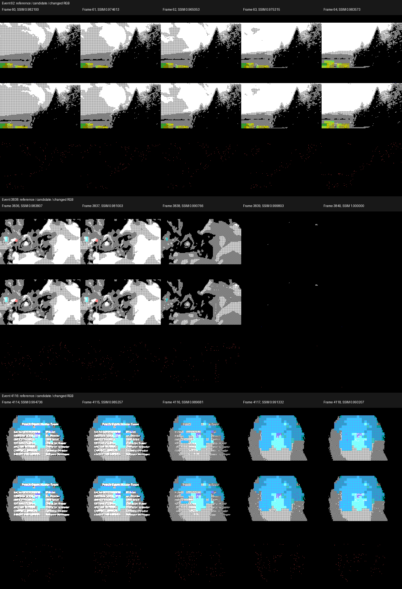

# Ограниченная ошибка на трёх соседних кадрах

18 сентября 2026, база `2de2203`. Полный фильм — 4971 кадр, прежние
256×192 (активная область 256×144), 25/3 кадра/с, четыре уровня
покрытия INK **0/25/50/100%**. Цветовые атрибуты отдельные, поэтому
это не ограничение всей картинки четырьмя цветами. Повторное сведение
к четырём уровням не даёт экономии: они уже занимают два бита.

## Что изменено

Предыдущий эксперимент разрешал ошибку в ячейке только один кадр
подряд; следующий обязан быть точным. Проверен лимит **три кадра**,
то есть до 0,36 с при 25/3 fps. Остальные ограничения прежние:

- не более двух изменённых логических пикселей в нативной ячейке 8×8;
- разница покрытия для каждого — не более одной четверти;
- RMSE усреднённого RGB в ячейке ≤24;
- не более 128 изменённых логических пикселей на кадр;
- все атрибуты точные; каждый кадр сравнивается с исходным Spectrum-
  фильмом, не с предыдущим уже приближённым кадром;
- прежнее движение ±4, штраф вектора 8, группы по восемь кадров.

Скрипт уже поддерживал параметр `--max-inexact`; добавлено только
явное сохранение базового коммита. Новый [кодировщик кандидата](encode_motion_candidate.py)
переобучает длины Хаффмана, сохраняя прежнюю карту 16 контекстов рисунка
и отдельный контекст атрибутов. Формат FHT1 и Z80-путь не меняются.
Контрольный age1 тем же скриптом воспроизведён **побайтно**, включая
таблицы, заголовки и весь поток; это отделяет эффект фильтра от кодека.

## Полные измерения

| Показатель | Лимит 1 кадр, база | Лимит 3 кадра |
|---|---:|---:|
| FHT1 до ZX0, байт | 2823159 | 2784318 |
| Optimal ZX0 8192 + заголовки, байт | 2033040 | **1988153** |
| Поправки, включая атрибуты | 1688733 | 1648908 |
| Поправки атрибутов | 36242 | 36242 |
| Кадры с кэшем движения | 4858 | 4822 |
| Группы / наибольший кодовый вход, байт | 622 / 8610 | 622 / 8612 |
| Максимальная длина Хаффмана, бит | 18 | 17 |
| Корни/хвосты таблиц до страниц сдвига, байт | 12195 | 12149 |
| SSIM, среднее | 0,9911854198 | **0,9884802967** |
| SSIM, минимум | 0,9668867701 | **0,9650532789** |
| SSIM, первый процентиль | 0,9756116969 | 0,9727103607 |
| Изменённые RGB-пиксели, среднее | 0,204015% | 0,281715% |
| Изменённые RGB-пиксели, максимум | 0,347222% | 0,347222% |
| Макс. последовательная ошибка пикселя/ячейки, кадров | 1 / 1 | 3 / 3 |
| Пропущенные изменения исходника, доля | 0,0267498072 | 0,0273957873 |
| Лишние изменения, в среднем пикселей/переход | 75,5062 | 72,4813 |

Экономия **44887 байт (2,2079%)** к контролю. Новых полностью
повторённых кадров нет. SSIM и доли изменений измерены по каждому
кадру относительно принятого Spectrum-видео, а не HD-оригинала;
SSIM нельзя трактовать как процент субъективной точности.
Пропущенные/лишние переходы — попиксельная диагностика, не optical flow.

Существующий AY 50 Гц не перекодировался: с прежней оценкой его хранения
77696 байт получаем **2065849 байт**. До щедрого бюджета трёх TRD
1937664 не хватает **128185 байт**, ещё до кода/структур томов. Это
прогноз по хранению, не три готовых образа. У лучшего ранее измеренного
порога FHT1 `128` 2032956 байт; относительно него экономия 44803 байта.

## Проверка качества и воспроизводимости

Исходные кадры: `9cc006a31408e2c3c3f96f96901b003756c2a480497e12d6b124baedafaeb35d`.
Кандидат: `4b9e90d22df2809a70c1cb09890de0a9bb0a23d1b1e357b3f6c29ff830cc9c3b`.
FHT1: `6e61aebc8174d4a532e205996e43a2ca9194187890e3efc769f88aa2816149df`.
Все 4971 кадр независимо восстановлены из FMR1 и FHT1; все **340
блоков настоящего optimal ZX0** побайтно проверены. Таблицы занимают
прежний банк 16 КиБ и прежние фиксированные области; это проверка
раскладки таблиц, не всей RAM/дискового расписания проигрывателя.

Просмотрены три пятикадровые последовательности: 60–64 (худший SSIM),
3836–3840 (больше всего пропущенных переходов), 4114–4118 (больше
всего лишних переходов). На контактном листе изменения представляют
отдельные точки; структура облаков, силуэтов и цветной детали сохранена.
Это **просмотр статических последовательностей**, не проверка фильма
в движении. Отчёт сохраняет `full_motion_viewing_complete=false`.



Пройдены шесть тестов bounded motion, включая новый тест обязательного
восстановления после трёх неточных кадров без накопления дрейфа,
неизменности атрибутов и независимого декодирования потока.

## Решение

Сохранить **как кандидат для сочетания с дальнейшим сжатием**, пока
не заменять базовый вариант и выпуск. Ошибка держится дольше и средний
SSIM ниже; экономии ещё недостаточно для трёх дискет. Перед принятием
требуется просмотр движения и проверка нового потока в полном плеере.
Не увеличивать допустимую амплитуду/число изменённых пикселей автоматически.

Горячий путь PLAYER не изменялся (**0 T** разницы реализации).
Полное время Z80 для новых данных не измерено: меньший объём и более
короткий максимальный код не доказывают скорость. Вывод, IRQ/ULA,
TR-DOS ROM, физический диск, уменьшенный дисковый буфер и плавные
8⅓ fps ещё не проверены. Новых TRD и изменений AY нет.

## Команды и отчёты

[Поиск и границы ошибок](bounded_motion_age3_measurements.json),
[качество каждого кадра](bounded_motion_age3_quality.json),
[кодирование/контроль](bounded_motion_fht_measurements.json),
[полный замер ZX0](bounded_motion_age3_fht_zx0.json).

```text
python toolkit/probe_bounded_motion.py --checkpoint SOURCE/conversion.npz --cache .tmp/bounded_motion_age3 --output toolkit/bounded_motion_age3_measurements.json --budgets 128 --max-inexact 3 --groups 8 --baseline-commit 2de2203
python toolkit/review_motion_quality.py --reference SOURCE/conversion.npz --candidate .tmp/bounded_motion_age3/bounded_motion_p2_b128_a3_e24.npz --output toolkit/bounded_motion_age3_quality.json --filmstrip toolkit/bounded_motion_age3_filmstrip.png
python toolkit/encode_motion_candidate.py --baseline-fht .tmp/hybrid_tiles/control.raw --candidates .tmp/bounded_motion/bounded_motion_p2_b128_a1_e24.npz .tmp/bounded_motion_age3/bounded_motion_p2_b128_a3_e24.npz --cache .tmp/bounded_motion_fht --output toolkit/bounded_motion_fht_measurements.json --baseline-commit 2de2203
python toolkit/probe_zx0_storage.py --raw .tmp/bounded_motion_fht/bounded_motion_p2_b128_a3_e24.fht --block-bytes 8192 --zx0 ZX0 --cache .tmp/bounded_motion_age3_zx0 --output toolkit/bounded_motion_age3_fht_zx0.json --jobs 4
cd toolkit
python -m unittest test_bounded_motion
```
