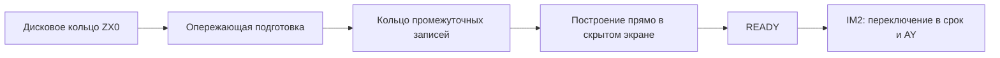

# Гипотеза: кольцо промежуточных данных и сборка прямо в скрытом экране

20 сентября 2026. Предложение пользователя, база `fa7cfb7`, 4221 кадр
без титров, прежние пиксели, AY 50 Гц и ZX0 **1932429 байт**.
Это план и проверка представления данных; новая реализация Z80 ещё не готова.

**Обновление 20 сентября:** производный формат B2 проверен исполняемым
Z80-потребителем на всех 4221 кадре. Даже с ускоренными пересылками вывод
дороже базы на 26,46%; благоприятная модель 30-КиБ очереди даёт 906 поздних
кадров. Эту реализацию пока не внедряем. Producer и реальное расписание
не готовы. [Полный опыт и ограничения](PREPARED_CELL_CONSUMER_ru.md).
Ниже сохранены исходная гипотеза и критерии сравнения.

**Обновление 25 сентября:** [ZX0 в одном банке](BANK_LOCAL_RESERVOIR_ru.md)
проверен на всех 378 блоках текущих трёх TRD. Ядро экономит 56997153 T,
но две LDI-пересылки входа съедают выигрыш. Новая модель на актуальных
таблицах каждого тома всё ещё даёт 185 поздних кадров с очередью 24 КиБ
даже при бесплатном входе и свободной остановке. Реальная очередь и
публикация в срок не подтверждены; этот путь с копированием не внедряется.

Следующий [опыт с кэшем движения](CACHE_COLUMNS_ru.md): парная пересылка
экономит 3466788 T без роста потока, но не устранила поздние кадры в
проверенном фрагменте. Половинки строк дают 18174739 T экономии копирования
ценой +7201 байт ZX0; полная доставка этого формата ещё не проверена.

[Списки цветовых групп](ATTRIBUTE_GROUPS_ru.md) сохраняют прежний поток
и сокращают подготовку/вывод атрибутов на 27873544 T на всех кадрах.
Первый пропущенный срок в частичном проигрывателе сдвинулся на один кадр;
полная плавность пока не достигнута. Два списка занимают 146 байт, новый
полный кадровый буфер не нужен.

[Пропуск пустых масок атрибутов](ATTRIBUTE_MASK_SKIP_ru.md) дополнительно
экономит 18519380 T реконструкции на всех кадрах без изменения потока.
Общий прогон продвинулся до 623 публикаций, но содержит 19 поздних кадров
и заканчивается недогрузкой AY. Это подтверждённое ускорение стадии,
не полное выполнение требований 120 мс и трёх TRD.

## Обязательный принцип: готовый экран не копировать

Окончательный кадр строится **сразу в невидимом экранном банке 5 или 7**.
Когда он готов, устанавливается READY. На исходном сроке +6 полей IM2
переключает экран и выполняет AY. После этого прежний видимый банк становится
местом построения следующего кадра. Готовый экран никуда не пересылается.
В текущем pipeline это переключение уже реализовано; сохраняем его.

Кольцо содержит промежуточные записи. FIFO полных native-экранов или
полных compact-снимков не вводим. Полный native-экран занимает 6144 байта
пикселей + 768 атрибутов = 6912 байт. В 30 КиБ вошли бы только четыре.
Текущее состояние предсказания 3840 байт остаётся рабочей памятью
декодера, а не копией native-экрана для последующей пересылки.



## Два уровня предварительной подготовки

### A. После ZX0: нынешние FAP3-пакеты

Снять внешний ZX0 заранее, хранить в кольце длину и весь пакет кадра.
При его потреблении остаются разбор масок, Huffman, предсказание, применение
дельт и native-вывод. Это относительно близко к нынешнему читателю, но
не переносит основную стоимость реконструкции из тяжёлой сцены.

### B. После реконструкции: команды вывода знакомест

Производитель выполняет ZX0, разбор, Huffman и предсказание заранее,
обновляя своё единственное compact-состояние. Затем формирует запись:

1. Два байта длины.
2. Шесть исходных AY-записей без изменения.
3. 72 байта native-маски активных 18 строк знакомест.
4. 576 окончательных атрибутов активной области.
5. Четыре compact-байта на каждое отмеченное знакоместо, в порядке маски.

Каждый compact-байт содержит четыре двухбитовых значения. Потребитель
читает последовательные значения, применяет таблицу развёртки и пишет
пиксели сразу в скрытый экран; атрибуты также поступают прямо в него.
Чёрные поля не обновляются. Карта относится к **n−2**, поскольку два
native-экрана чередуются. Нельзя заменить её дельтой только к n−1.

В этом варианте потребителю не нужен будущий compact-кадр: производитель
может продолжать менять своё состояние независимо от текущего вывода.
Huffman нельзя просто снять отдельным проходом по символам: выбор таблицы
зависит от предсказанного значения, поэтому необходима соответствующая
реконструкция. Именно её результат попадает в команды.

Формат B — **только внутреннее представление RAM**, не новый формат TRD.
Его больший размер не добавляется к дисковому потоку.

## Размеры, посчитанные по всем кадрам

| Данные кольца | Средний размер кадра | Максимум | Средняя оценка кадров в 30 КиБ | Минимум на реальных непрерывных участках |
|---|---:|---:|---:|---:|
| A: пакет после ZX0 | 732,80 байта | 3647 | 41,92 | **14 кадров / 1,68 с** |
| B: подготовленные знакоместа | 1755,73 байта | 3028 | 17,50 | **10 кадров / 1,20 с** |

Размеры включают длину и AY. Очередь должна быть плотной, с записями
переменной длины: фиксированные слоты по максимальному размеру потеряют
значительную часть вместимости. Конечные короткие хвосты фильма исключены
из статистики минимального окна. Это вместимость уже заполненной очереди,
**не доказательство, что CPU и дисковод успеют поддерживать её запас**.

Для B выполнен независимый Python-разбор и воспроизведение масок/значений
на двух чередующихся состояниях: все 4221 активных изображения и атрибуты,
все 25326 AY-записей точны. Последовательность с маской n−2 проверена.
Инструкции Z80 потребителя B, его скорость и банковый транспорт ещё
не реализованы. Проверка пикселей здесь не является проверкой плавности.

## Раскладка 128 КиБ для прототипа

| Банки | Предложенное назначение |
|---|---|
| 0, 1 | Сжатое дисковое кольцо **32 КиБ вместо 64** |
| 3, 4 | **30 КиБ** промежуточных записей + **2 КиБ** резерва управления |
| 5 | Основной экран, TR-DOS workspace, compact-состояние, cache, фиксированный код |
| 2 | Фиксированный код, таблицы, входное окно, IM2, AY, стек |
| 6 | Таблицы Huffman |
| 7 | Второй экран, читатель/парсер/планировщик, рабочая история ZX0 8 КиБ |

30 КиБ не являются свободной памятью: их получаем перераспределением
двух банков прежнего дискового кольца. Прежде чем принять эту раскладку,
нужно проверить устойчивость чтения TR-DOS с кольцом 32 КиБ на эмуляторе,
учитывая ROM, вращение/поиск и остановки подачи; средний поток недостаточен.
Дополнительные указатели, длины, флаги готовности и состояния пауз должны
получить конкретные адреса. Резерв 2 КиБ — бюджет, не готовая раскладка кода.

## Как ограничить копирование

- Не создавать готовый экран во временном буфере. Вывод только в банк,
  который в данный момент скрыт. IRQ меняет бит экрана, а не память кадра.
- Не копировать compact-снимок для каждого будущего кадра. Сохранять только
  нужные значения B, необходимые независимо от меняющегося состояния producer.
- Писать сформированную запись непосредственно в кольцо; потреблять её
  последовательно. Отдельный «пакет → временный пакет → очередь» не вводить.
- Не обещать нулевое копирование всех байтов. Банк кольца 3/4, Huffman-банк 6
  и экранный банк 7 занимают одно переключаемое окно C000..FFFF. Они не
  доступны там одновременно. Для экрана 5 возможен прямой доступ из
  отображённого кольца; для экрана 7 нужно сравнить маленькую фиксированную
  порцию и передачу через регистры с переключениями страниц.
- Кандидат для порции — прежний MAP 7300..73FF (256 байт) в режиме FAP3
  zero-copy: compact заканчивается на 72FF, cache начинается с 7400.
  Перед использованием проверить все существующие режимы и защиты;
  producer с живым входным пакетом нельзя затирать общим рабочим окном.
- Считать все записи в очередь, staging, разбор, paging и окончательный
  вывод. Экономия времени перед дедлайном может сопровождаться ростом
  суммарного CPU; этот рост должен помещаться в общий бюджет.

AY хранится вместе с будущими записями, но переносится в существующую
малую AY-очередь только при наличии места. Нельзя сразу enqueue звук
десятков кадров: нынешняя очередь содержит 32 слота. Проигрывание остаётся
на каждом IRQ 50 Гц, а не на скорости наполнения промежуточного кольца.

## Что говорит обновлённая оценка только ZX0

Старые расчёты уже исследовали очередь ZX0 на другой версии. Новый скрипт
использует полный `token_boundary_fast_cpu.json` и подтверждённую экономию
unrolled-copy −13147366 T, сохраняя реальные покадровые расходы остальных
стадий. Работу ZX0 приближённо распределяет по потреблённым байтам, разрешает
бесплатные паузы и идеальную подачу; дополнительные новые scheduler/paging,
транспорт, ULA, ROM и диск исключены. Это **модель, не прогон Z80**.

| Распакованные слоты | Первое позднее изображение | Поздних кадров в модели |
|---|---:|---:|
| 8 КиБ | 409 | 1425 |
| 24 КиБ | 637 | 882 |
| 32 КиБ | 646 | 748 |
| 40 КиБ | 651 | 625 |
| 56 КиБ | 674 | 382 |

Значения для 32 КиБ относятся к четырём слотам ZX0 по 8 КиБ, а не к
точной предложенной упаковке кольца 30 КиБ. 40/56 КиБ — чувствительность
модели, не обещание их размещения вместе с новой дисковой очередью.
Даже благоприятная модель A не даёт нуля опозданий. Это не опровержение B:
в B заранее выполняется ещё и реконструкция, его расписание не моделировалось.

## Сравнение и выбор по результатам

Пользователь уточнил: это гипотеза, прежний вариант можно оставить, если
он эффективнее. **Победитель пока не определён.** Существующий pipeline
остаётся базовым; размер очереди и проверка Python не обосновывают замену.
Полная пересылка native-кадра уже отсутствует в базе, поэтому её отсутствие
в кандидате не считается новым ускорением.

Сравнить три варианта на одинаковых кадрах, AY и потоке диска:

| Вариант | Статус сейчас | Что ещё нужно измерить |
|---|---|---|
| Прежний pipeline + LDI | Исполняемый CPU-кандидат, тяжёлая сцена опаздывает | База для сравнения, полного выпуска на трёх TRD нет |
| A: очередь после ZX0 | Размеры и приближённая модель | Настоящий reader/transport/scheduler и диск |
| B: очередь после реконструкции | Размеры и точность Python-представления | Z80 producer, consumer, transport, scheduler и диск |

В отчёте каждой версии отдельно учитывать:

- Сумму **producer + записи/чтения кольца + paging + consumer**. Перенос
  работы раньше не называть её устранением; рост стоимости копий не скрывать.
- Все исходные сроки публикации, число поздних кадров, реальное отклонение
  T, восстановление серий и отдельно резерв 20 мс; звук на каждом IRQ.
- Минимальный запас обеих очередей, число/объём пересылок, полный баланс
  128 КиБ и измеренную устойчивость дисковой подачи. ROM/ULA/диск отдельно.
- Те же пиксели/атрибуты/AY, EOF и финальную сцену, отсутствие обновлений
  чёрных полей, правильную полоску текущего тома и размер итоговых TRD.

Новый вариант развивать, если измерения показывают выигрыш для достижения
сроков и допустимый суммарный расход ресурсов. При ухудшении оставить базу
и записать отрицательный результат. Проверку небольшого участка считать
только отбором кандидата; окончательное решение требует полного фильма.

## Порядок следующего эксперимента

1. Оставить ZX0/пиксели/AY на диске прежними и сохранить базовый pipeline.
   Проверить цену варианта B как кандидата: он переносит реконструкцию
   из непосредственной подготовки экранного банка, но добавляет очередь.
2. Сделать Z80-потребитель B, пишущий сразу в скрытый экран, проверить
   нулевые/плотные маски, оба банка, границы кольца и пропуск чёрных полей.
3. Измерить обе траектории доступа к памяти, сравнить их с нынешним
   native-выводом; зафиксировать абсолютные T и разницу. Затем реализовать
   producer, который формирует B после настоящей реконструкции, и измерить
   дополнительную цену формирования/хранения.
4. Ввести состояния «запись строится / полностью готова / потреблена»,
   не перезаписывать данные до потребления. Наполнять очередь до старта AY.
   Добавить ограниченные точки уступки producer, чтобы длинная подготовка
   будущего кадра не блокировала своевременный вывод уже готовой записи.
5. Публикации сохраняют исходную сетку +6 полей, приоритет нулю опозданий.
   Проверить полный фильм, восстановление возможных поздних серий, фактические
   T переключения, AY, EOF, границы томов и полоску текущей дискеты.
6. Только после проверки CPU/памяти измерить подачу 32-КиБ дискового кольца,
   ROM/ULA и собрать до трёх настоящих TRD с загрузчиком и Git LFS.

**Решение:** сохранить гипотезу и критерии выбора; проверить прототип B,
сохранив прежний pipeline как базу и A как более простой контроль. Замену
не принимать до сравнительных измерений. В этой записи hot path не изменён: **0 новых измеренных T**,
0 байт прироста дискового потока, корневые образы прежние.

## Воспроизведение

```powershell
python toolkit/probe_predecode_reservoir.py --raw .tmp/lean_frame/stream.raw --states .tmp/no_credits/source/conversion.npz --cpu toolkit/token_boundary_fast_cpu.json --storage toolkit/lean_frame_zx0.json --copy-report toolkit/unrolled_packet_copy_cpu.json --output toolkit/predecode_reservoir.json
```

Два первых запуска выявили отсутствующий ключ banked_zx0 в кадрах/частях
заголовка, где новых ZX0-инструкций не было. Исправлен учёт нулевой стадии;
проверки и проигрыватель не ослаблены. Итоговый отчёт содержит все размеры
по кадрам и 15 сценариев модели с проверками EOF, ёмкости и суммы работы.
[Скрипт](probe_predecode_reservoir.py), [отчёт](predecode_reservoir.json).
